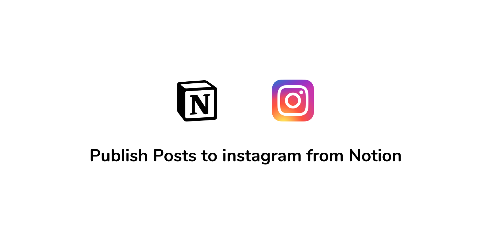
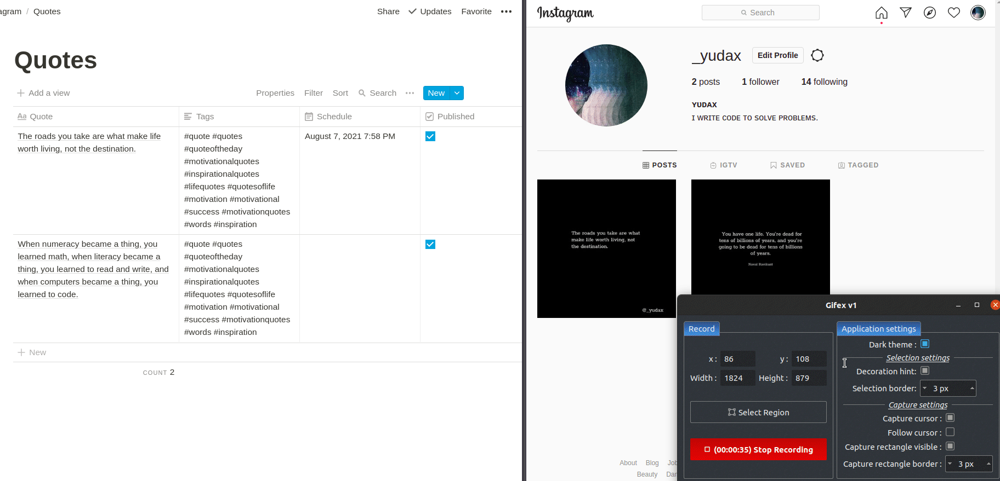

## Notion To Instagram

This tool enables you to publish Instagram posts directly from Notion, with the scheduling posts feature that helps you to plan and publish posts automatically. All in one place!

# Demo

# Features

- 🖼️ Publish posts with images
- ✍️ Publish posts with just text (it automatically create an image with the text content)
- ⏲️ Scheduler - schedule your Instagram posts to be published automatically with the given date

# Documentation

[Documentation](https://bit.ly/3At2lJv)

# Deploy To Heroku

